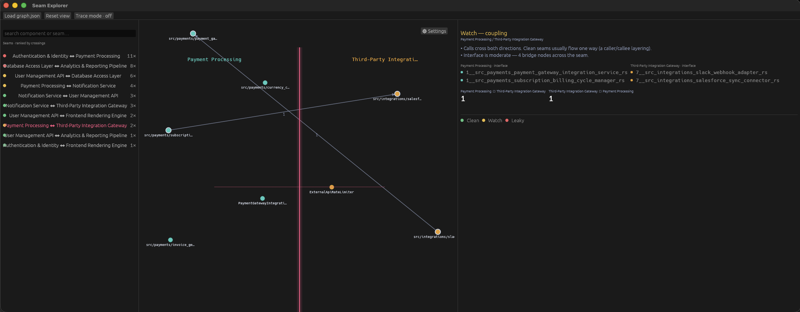

# Seam Explorer



Seam Explorer is a native macOS desktop app that visualizes **architectural
seams** — the boundaries between components (communities) in a codebase graph
produced by [Graphify](https://github.com/esumerfd/graphify). It shows what
sits on either side of a seam and lets you trace a call path across seams to
see real coupling.

You can see the components on either side of an architectural seam and trace
a call path across seams to understand how decoupled — or leaky — that
boundary really is.

The app is read-only: it never edits your codebase or the graph, and nothing
is shared or exported — each teammate runs it locally against their own
`graph.json`.

## Requirements

- macOS (this is the only supported platform)
- [Rust](https://rustup.rs) (stable toolchain, installed via `rustup`)
- [Node.js](https://nodejs.org) — needed only for the Tauri app (`seam-explorer`);
  the native egui app (`seam-explorer-egui`) needs Rust and nothing else
- [`cargo-bundle`](https://github.com/burtonageo/cargo-bundle), installed with
  `cargo install cargo-bundle --version 0.11.0 --locked` — needed only to produce
  an installable `seam-explorer-egui` `.app` (`make bundle-egui`/`make install-egui`)
- A `graph.json` file produced by Graphify

## Building and running

This repo holds two front ends over one shared `seam-core`: `seam-explorer`,
the Tauri/webview app (`make build`, `make run`, `make install`), and
`seam-explorer-egui`, the native egui rebuild (`make run-egui`,
`make test-egui`, `make bundle-egui`, `make install-egui`). They install side
by side under different names so they can be compared, which is why the egui
build exists.

```sh
git clone git@github.com:esumerfd/arch-visual.git
cd arch-visual
make run
```

`make run` installs npm dependencies on first use and launches the Tauri app in
its dev mode. To run the native egui app instead, use `make run-egui` — no npm
dependencies needed.

There is some sample data in sample. Select Load graph.json and select that
file — `sample/graph-demo.json` is a smaller, faster demo graph and
`sample/graph.json` is the full one. To skip the dialog, pass the path as the
first argument, either via `make run-egui GRAPH=<path>` or directly on the
binary:

```sh
make run-egui GRAPH=sample/graph-demo.json
```

To produce a native `.app` bundle instead:

```sh
make build
```

The bundle is written to `seam-explorer/target/release/bundle/macos/`.

The egui app bundles the same way: `make bundle-egui` writes
`Seam Explorer (egui).app` to `target/release/bundle/osx/`. It produces an
`.app` only — no `.dmg`.

## Installing

```sh
make install
```

This builds a release bundle and copies `Seam Explorer.app` into
`/Applications`.

`make install-egui` does the same for the native egui app: it bundles,
copies `Seam Explorer (egui).app` into `/Applications`, and clears the
Gatekeeper flag for you — same as `make install`, just for the other app.
Like `make bundle-egui`, it produces an `.app` only, no `.dmg`.

### Why does macOS warn me when I open it?

Both apps are unsigned — neither is distributed with an Apple Developer
certificate, since these are internal tools rather than a public release.
macOS Gatekeeper will block them by default. `make install` and
`make install-egui` already run the fix (`xattr -cr`) for you; if you instead
copy a `.app` in some other way and see "app is damaged and can't be opened,"
run:

```sh
xattr -cr "/Applications/Seam Explorer.app"
```

or, for the egui build:

```sh
xattr -cr "/Applications/Seam Explorer (egui).app"
```

This unblocks only the one app you installed — it does not disable
Gatekeeper for anything else.

## User guide

### Loading a graph

Click **Load graph.json** and pick a `graph.json` file exported by Graphify
(NetworkX `node_link_data` format: a `nodes` array with `community` per node,
and a `links` array of edges).

### Exploring seams

Once loaded, the graph renders as communities of nodes with the **seam** —
the crossing edges between two communities — highlighted. Use the search box
to jump to a specific component or seam by name.

Selecting a seam shows its detail: the bridge nodes on each side (the ones
with at least one edge crossing the boundary), the crossing calls and their
direction, and a computed verdict:

- **Clean** — crossings flow one way, no cycle between the two communities.
- **Watch** — crossings exist both ways but no confirmed cycle; worth
  keeping an eye on.
- **Leaky** — a real cycle crosses the seam, meaning the two communities
  depend on each other rather than being cleanly layered.

### Tracing a call path

Toggle **Trace mode**, then drag from one component to another to compute
and draw the path between them. The trace highlights every seam the path
crosses, so you can see exactly how many architectural boundaries a call has
to cross to get from A to B.

Use **Reset view** at any point to clear the current search, trace, and
zoom/pan state.

## Project layout

```
arch-visual/
├── docs/                              design docs for the app's two
│                                       considered implementations (Tauri,
│                                       the one that shipped, and egui)
├── sample/                            sample graph.json to try the app with
├── seam-core/                         graph model, seam detection, tracing —
│                                       shared, unchanged, by both apps below
├── seam-explorer/                     the Tauri app
│   ├── src/                           Rust/Tauri backend (commands, state)
│   ├── frontend/                      HTML + D3 webview UI
│   └── tauri.conf.json
└── seam-explorer-egui/                the native egui app
    ├── src/                           eframe/egui app, no webview/IPC
    ├── icons/                         self-contained icon set for this app's bundle
    └── Cargo.toml                     also carries this app's [package.metadata.bundle]
```
